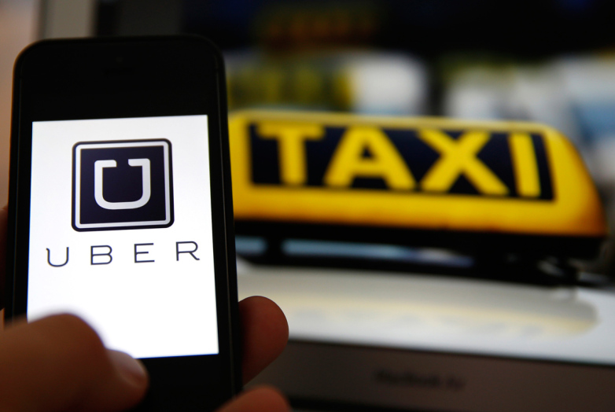

 
 

# THE MEDIA'S PERSPECTIVE OF UBER'S DISRUPTION OF TAXI INDUSTRY IN CROATIA

  

 
 

## Abstract

The main aim of this study is to explore the media's perspective of Uber's disruption of taxi industry in Croatia. 
 
The research rationale emerges from the following setting. Uber entered the national market in late 2015. Immediately afterwards, the traditional taxi industry actors started organizing a wide range of protests against Uber claiming, in the first place, that their partner-drivers do not have the mandatory taxi license which, according the Law on Road Transportation, makes their business operations illegal. The state took the same stance; among other actions, they were issuing fines to Uber’s partner-drivers operating without the taxi license and filed a motion to a Misdemeanor court to temporarily ban Uber app in Croatia. On the other hand, Uber claimed that: a) they themselves are not in the taxi business but (solely) run the app that connects passengers with drivers who offer car rides, b) their partner-drivers are not in the taxi business but offer the service of “special form of transportation” which is regulated / allowed by the Law, and c) that the general public increasingly uses and likes their product. In the meantime, since this setting was long-term untenable for all the stakeholders, they were working together on a new regulatory framework. In the first half of 2018, the new Law on Road Transportation was introduced, the national taxi industry got (completely) liberalized, and Uber’s partner-drivers were officially labeled as taxi service providers. The predominant discourse was that the state opted for the (full) market liberalization option because it is what the public wanted. 
 
Therefore, starting from the research findings emphasizing that the media tends to shape the public opinion, this study investigates the image of the Uber’s disruption that the media in Croatia presented. 
 
The investigated period spans the period when the public opinion influenced by the media could have been potentially relevant for the politicians / regulators’ decision-making process i.e. the period between the company entered the market (mid-October 2015) and the introduction of new regulatory framework (mid-April 2018). The data was extracted from the on-line edition of Večernji list, an influential high-circulation national daily newspaper.  
The initial sample embraced all the newspaper articles on the taxi industry published in the analyzed period. To make sure the study does not get biased, the content analysis discarded from further investigation PR / sponsored articles and taxi industry news unrelated with the national market (e.g. Uber's market share in the UK). The final sample consisted of ? articles (average of ? news per analyzed month).
The main data analysis consisted of qualitative part i.e. thematic analysis conducted with Atlas.ti software and quantitative part i.e. keywords analysis and sentiment analysis conducted with R software.
 
The keywords analysis confirmed Uber being the main disruptor of the national taxi industry and revealed an increased stakeholders' joint focus on the regulatory framework issues. The qualitative analysis identified the following themes: a) Uber, b) The conflict among the stakeholders, c) Traditional taxy industry's response to the conflict, d) The state's response to the conflict, e) The Uber's response to the other stakeholders' stance on the topic, and f) Uber and traditional taxi industry's response to the features of new regulatory framework. The keywords analysis conducted within each of the categories showed e.g., types of response to the conflict used at Uber Croatia and among the traditional taxi drivers. Finally, the sentiment analysis reported a predominantly positive sentiment towards both Uber and the events in the market throughout the entire period.  
 
 
Keywords: Uber, Croatia, disruption
 
 
The preliminary presentation of results can be found on the [link]().
